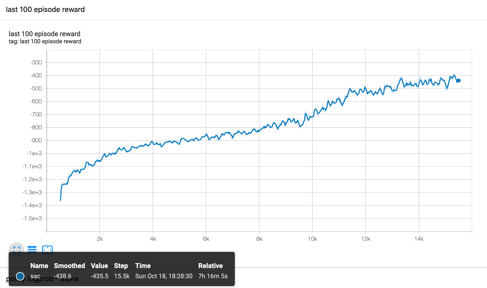
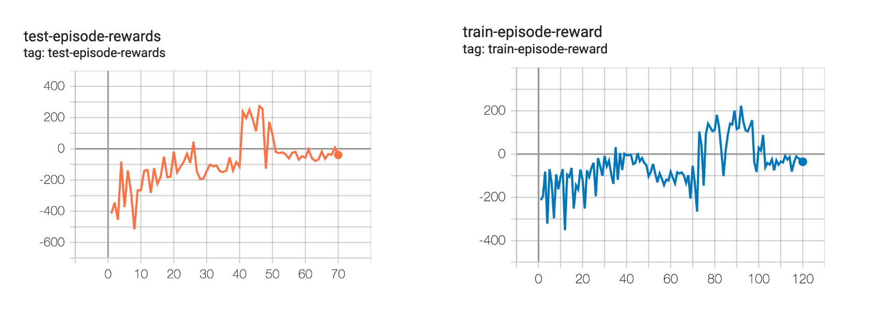

# Soft Actor-Critic 

<center>
</a>
</center>

Reimplementation of the 2018 paper Soft Actor Critic - an off-policy, continuous actor-critic reinforcement learning algorithm.


## Setup

```bash
$ brew install swig
$ make setup
```

If you are running Big Sur, you may have issues with `pyglet` - [see here](https://github.com/openai/gym/issues/2101).


## Train

`Pendulum-v0` - [source](https://github.com/openai/gym/blob/master/gym/envs/classic_control/pendulum.py)

```bash
$ sac benchmarks/pendulum.json
```




`LunarLanderContinuous-v2` - [source](https://github.com/openai/gym/blob/master/gym/envs/box2d/lunar_lander.py)

```bash
$ sac benchmarks/lunar.json
```



Notes
- if you enter the same run name via `-n`, program will ask if you want to delete
- if no run name entered, new run will be created at `run-n`, where `n` = last run number + 1


## Play

Will load the best actor based on test rollouts:

```bash
$ sac/play.py experiments/lunar/run-1
```


## References

[Open AI Spinning Up](https://spinningup.openai.com/en/latest/algorithms/sac.html)

[Haarnoja et. al (2018) Soft Actor-Critic: Off-Policy Maximum Entropy Deep Reinforcement Learning with a Stochastic Actor](https://arxiv.org/abs/1801.01290) - [pdf](https://arxiv.org/pdf/1801.01290.pdf)


## Implementations

Open AI Spinning Up - TF 1

- [sac.py](https://github.com/openai/spinningup/blob/master/spinup/algos/tf1/sac/sac.py)
- [core.py](https://github.com/openai/spinningup/blob/master/spinup/algos/tf1/sac/core.py)

[Stable Baselines - TF 1](https://stable-baselines.readthedocs.io/en/master/modules/sac.html)

SLM-Lab

- [sac.py](https://github.com/kengz/SLM-Lab/blob/master/slm_lab/agent/algorithm/sac.py)
- [lunar lander benchmark hyperparameters](https://github.com/kengz/SLM-Lab/blob/master/slm_lab/spec/benchmark/sac/sac_lunar.json)
